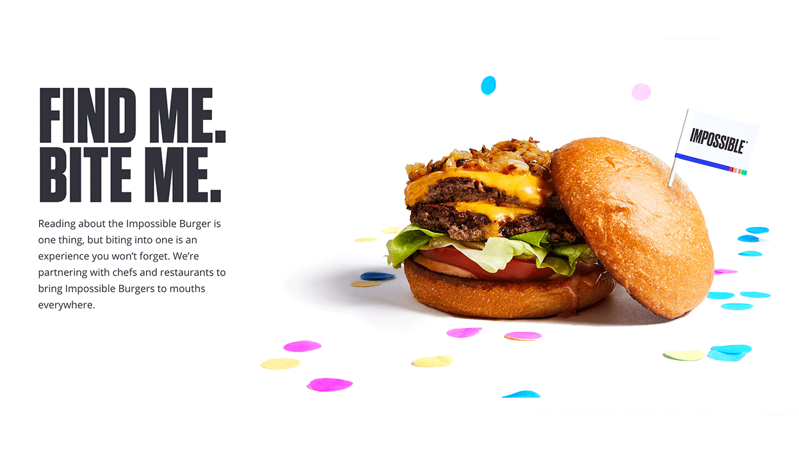
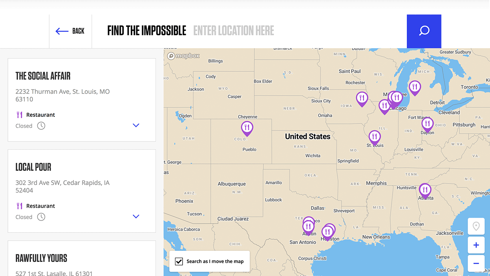
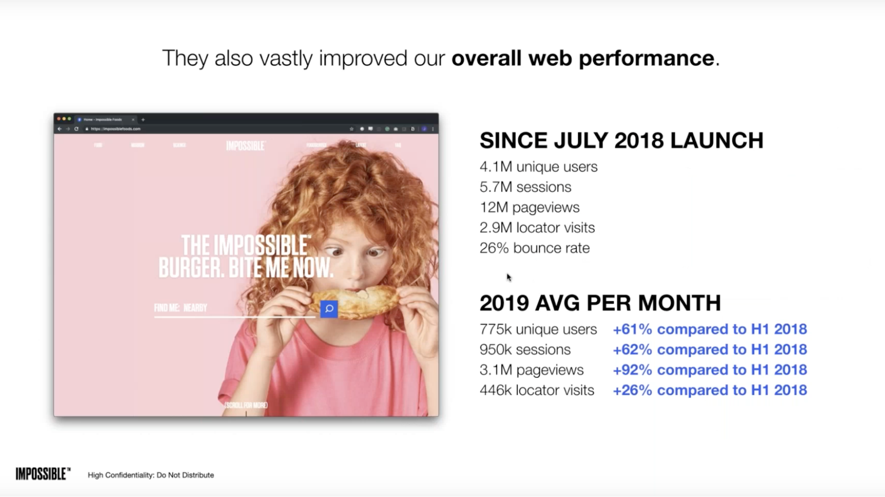

"Meat analogues" is a terrific punk band name. But it also describes one of the hottest current trends in food: plant-based protein products so realistic that they fool even hardcore carnivores, with a side of combatting climate change. One of the fastest growing alternative meat companies is Impossible Foods, particularly famous for their juicy yet plant-based Impossible Burger. When Burger King decided to offer a vegetarian version of their trademark Whopper, they chose the Impossible Burger---and Impossible Foods grew from supplying 100 restaurants to 5000, overnight.

The company has been growing exponentially ever since, but unfortunately the original Impossible Foods website was not able to scale along with it. They turned to Gatsby to give their users a new and faster site that helped them solve their most pressing business problem: helping customers quickly find local retailers and restaurants offering Impossible Burgers. Gatsby, it turned out, was also the perfect platform for building an interactive store locator map that was beautiful, intuitive, and the fastest possible route for connecting users with the closest possible Impossible Burger.

## The old website: Failing to find an Impossible Burger

As demand skyrocketed, hungry customers flocked to the company's website to find out where they could experience an Impossible Burger in their local area. The original website showed users a static list of all Impossible Food locations, grouped by state.

This meant that users had to scan a long and ever-growing list of retailers and restaurants, sorted alphabetically rather than geographically. They then had to use external tools like Google Maps to figure out the location closest by. Rather than navigate through this complicated process, many users simply gave up. Impossible Foods was losing an untold number of excited potential customers.

"Our product would be in certain places, and people wouldn't know it was there," explains Ashley Geo, Head of Brand Marketing Communications for Impossible Foods. Alternatively, she adds, "It wouldn't be in other places, but people would guess that it was there" - only to leave empty-handed and disappointed.

Initially the team only had one person to oversee the website. They handled requests from all over the company --- recruiting, sales, other parts of marketing --- for adding new information to the website. Any actual site updates for design, copy or code were handled by a contractor. This required significant turnaround time, so updates often accumulated in a backlog.

Geo had been thinking about a website redesign for a while anyway. The store locator problem was the final straw. As a result, her team decided to create a new website -- ImpossibleFoods.com 2.0 -- that would be easy to update, scale to the needs of the company, and provide users with a key experience lacking in the old site: easily finding the nearest Impossible Burger. 

## A New Store Locator: The Discovery Phase

Impossible Foods worked with [Matter Supply](https://mattersupply.co/), a Portland-based digital design and development agency, to re-launch their website with Gatsby. There were several motivations, including performance and the ability of teams to make changes quickly. The prime directive, though, was creating a new, rich map experience that reflects the originality of the Impossible Burger while being easy for customers to use, and content editors to update.

Map locators are one of the most common complicated experiences right now on the web according to David Fonnegra, an engineering leader at Matter Supply who leads the Impossible Foods redesign. "It's really difficult to make a cartography experience that appeals to everybody," he points out.

Fonnegra lists a whole host of usability challenges when building a store locator experience:

"How do you usually navigate? Do you search for addresses? For places? For zip codes? For cities? For locations? What does the map pin stand for? Where are you? How do you identify the place you want to go? Is the distance useful for you? Does seeing the actual path help? Or is it the distance that's helping you? Is a list of places more useful for you than the actual map?

"We had a lot of questions to start with...But zero answers."

For Fonegra and Impossible Foods, the only way out was straight on through: "The only great way to start answering those questions was releasing a nice experience for the people."

That meant building a rich application, with a whole host of technologies, i.e., React and Gatsby on the front-end, plus Mapbox for visualization; Airtable to enter store location data, plus Elastic for natural language search and geolocation filtering. The Matter Supply team also chose Contentful's headless CMS for content management.

## A New Content Workflow

The content management strategy is particularly interesting. Overall it's a great demonstration of the [content mesh](/blog/2018-10-04-journey-to-the-content-mesh/) - a modular approach to constructing websites using best-fit services rather than a monolithic, one-size-fits-none CMS solution. So while Impossible Foods website content is stored in and managed from Contentful, product location data is stored and managed via Airtable's spreadsheet/database hybrid. This simplify workflow for Impossible customer service representatives (CSRs) maintaining the locator app, while enabling the marketing team to easily create and update other content.

"Content-wise, a store locator is very simple," says CMS guru Deane Barker, the author of the O'Reilly guide to content management. "It's tabular data, which means it can be easily managed via a spreadsheet through rows and columns. To manage the store locator, you often have a different group of people than the marketing editorial team. So, it needs to be a simple interface. You don't want to train them on a larger CMS. They just have to maintain the store locator."

The store locator is a use-case, Barker concludes, that calls for more "simple and direct content management."

That squares with Fonnegra and Impossible's experience. The Impossible Foods' customer service representatives use Airtable for a wide variety of operational tasks, including tracking new launches of the Impossible Burger. And, of course, for the store locator, tracking information for all restaurants selling Impossible products. Airtable is the center of the CSRs workflow, and the [native integration with Gatsby](/packages/gatsby-source-airtable/?=gatsby-source) allows them to work in the system they're used to---while enjoying the blazing fast mechanics of a modern website working smoothly in the background.

As a result, Impossible Foods website content creators and CSRs get best fit tools that are comfortable to use, while end-users get information that is always up to date and relevant.

## An Improved User Experience

The new site provides more than just up to date data, though: users also get a dynamic, interactive experience with store locator and mapping features.

The new store locator combines natural language searches, geolocation filtering, and an interactive map feature to help the end-user find the closest location where they can get the Impossible Burger.

The interactive map feature now allows customers to simply enter their location information to find nearby Impossible Burger purveyors. This reduces the original five or six step process, including tedious scanning and off-site searching on Google Maps, to a single step.

And because their website was on Gatsby, the user experience was always blazing fast.

## Business Results

The new Impossible Foods site wasn't just great for users and content creators. It was pretty incredible from a business bottom line standpoint, too!

During the six months post-launch, increased brand awareness drove a spike in overall site usage---and the customers landing there enjoyed a quantitatively improved experience.

Both the store locator app and the overall site itself saw bounce rate reductions of 30-40%. Inside the company, Geo and her digital marketing team enjoyed greatly increased agility in serving the needs of a rapidly growing company. As a result, 2019 saw a flurry of launches:

- A food service hub to support restaurants serving the product

- Improvements to the online help center managed by the customer service team

- A new Careers page

- An incredibly fast turnaround for campaign pages around Impossible Food's partnerships with Burger King and Little Caesars.

- Partnerships that were widely covered by media and rocketed Impossible Foods' brand outreach into millions of households across the US.

## Conclusion

When Impossible Foods moved their website from a static single-page to a dynamic setup involving Gatsby sourcing data from Airtable, Contentful, and Mapbox, with a beautiful, interactive store locator map, it wasn't just the technology that changed. It was the future of Impossible Foods and the marketing team's ability to create a digital experience matching the scale and ambition of their company.

Ultimately, Geo credits Impossible Foods' choice of technologies as the key that unlocked the company's growth.

"We are able to change and scale quickly and responsively," Geo says, "Because our current tech stack is awesome."

## Still hungry for more?

Check out this [webinar with Gatsby and Contentful](/impossible-foods-webinar/) to hear Ashley Geo (Head of Brand Marketing-Communications at Impossible Foods) and David Fonnegra (Lead Technologist at Matter Supply) talk about delivering new features and content on impossiblefoods.com within often-impossible timeframes—and how they empowered the Impossible™ Digital team to increase customer engagement by more than 40%. Gatsby co-founder Kyle Mathews and Jim Ambras, Senior Technical Trainer at Contentful, join them.

<CloudCallout>
  Sites built with Gatsby are fast no matter where they run. But when a Gatsby
  site runs on Gatsby Cloud, its builds get even faster!
</CloudCallout>

Deane Barker highlighted the store locator use-case [in a March 2019 podcast](https://www.ingeniux.com/company/podcast/content-matters-podcast-headless-content-management-with-deane-barker).
